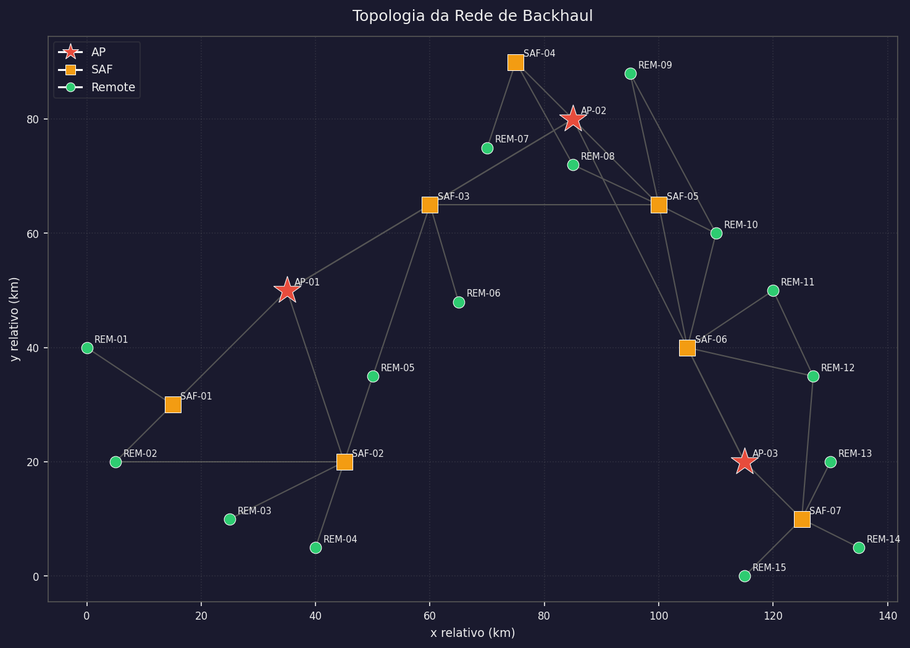
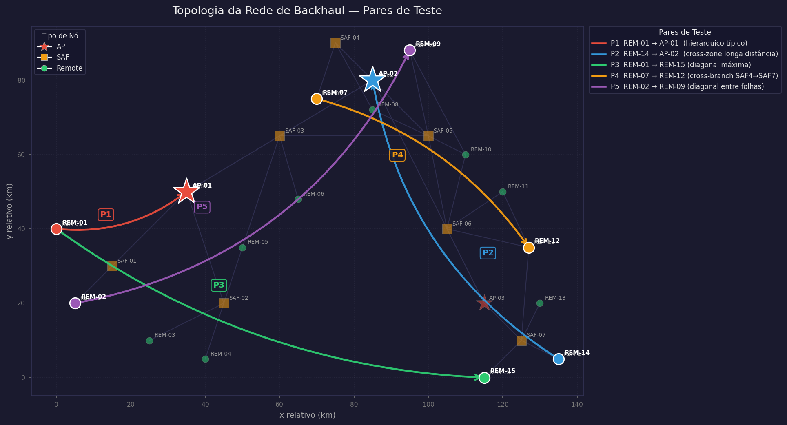

# Trabalho 02 — Análise de Algoritmos de Busca em Grafos

**Disciplina:** Fundamentos de Algoritmos e Estrutura de Dados (FAED)
**Programa:** PPGIA — PUC-PR
**Prof.:** André Gustavo Hochuli

---

## Domínio

Rede de backhaul sem fio para smart grid, modelada a partir das características
do rádio **GE MDS Orbit MCR 900 MHz**. A topologia é **inteiramente sintética**.

Os parâmetros de enlace (RSSI, SNR, latência, throughput, perda de pacotes)
foram gerados pelo modelo Friis + sombreamento log-normal com semente RNG fixa
(`seed=42`), garantindo **reprodutibilidade total**.

---

## Topologia

| Tipo     | Qtd | Descrição                                          |
|----------|-----|----------------------------------------------------|
| AP       |   3 | Access Points — nós raiz com backbone cabeado      |
| SAF      |   7 | Store-and-Forward — repetidores intermediários     |
| Remote   |  15 | Concentradores de medidores inteligentes / RTUs    |
| **Total**| **25** | **34 enlaces não-direcionados**               |

### Peso do enlace (custo composto)

```
peso = 100 × (0.4 × latência_norm  +  0.4 × (1 − tp_norm)  +  0.2 × perda_norm)
```

Normalização usada: `latência_norm = min(latência_ms / 20, 1)`,
`tp_norm = min(throughput_kbps / 914.0, 1)` e
`perda_norm = min(perda_pct / 15, 1)`.

### Heurística A\* / Gananciosa (admissível e consistente)

```
h(n) = dist_euclidiana(n, destino) × custo_mínimo_por_km
```

### Visualização





---

## Algoritmos Implementados

| Arquivo             | Algoritmo         | Otimalidade |
|---------------------|-------------------|-------------|
| `src/dijkstra.py`   | Dijkstra          | Sim         |
| `src/astar.py`      | A\*               | Sim         |
| `src/greedy.py`     | Busca Gananciosa  | Não         |
| `src/bfs.py`        | BFS               | Saltos mín. |
| `src/dfs.py`        | DFS               | Não         |

---

## Configuração Experimental

**5 pares · 5 repetições por par · 5 algoritmos = 125 execuções**

| # | Origem | Destino | Tipo de Cenário |
|---|--------|---------|-----------------|
| P1 | REM-01 | AP-01   | Remote → AP-raiz (caminho hierárquico típico) |
| P2 | REM-14 | AP-02   | Extremo leste → AP norte (cross-zone longa distância) |
| P3 | REM-01 | REM-15  | Extremo oeste → extremo sul (diagonal máxima, 24 nós) |
| P4 | REM-07 | REM-12  | Cross-branch SAF4→SAF7 (rota com cross-links) |
| P5 | REM-02 | REM-09  | Remoto SW → Remoto NE (diagonal entre folhas) |

**Métricas coletadas por execução:** tempo (ms) · nós expandidos · custo do caminho · saltos · pico de memória (KB)

> Tempos < 1 ms para todos os algoritmos na escala de 25 nós — variância dominada por interrupções de SO e GC do Python. Métrica mais informativa: **nós expandidos**.

---

## Resultados

### Nós Expandidos (média por par)

| Algoritmo   | P1 | P2 | P3 | P4 | P5 |
|-------------|----|----|----|----|-----|
| Dijkstra    |  4 |  9 | 24 | 22 | 18 |
| A\*          |  3 |  7 | 19 | 15 | 14 |
| Gananciosa  |  3 |  6 | 12 |  6 |  9 |
| BFS         |  3 |  7 | 25 | 22 | 19 |
| DFS         |  3 |  4 | 25 | 15 | 17 |

### Custo do Caminho (média por par)

| Algoritmo   | P1      | P2      | P3      | P4      | P5      |
|-------------|---------|---------|---------|---------|---------|
| Dijkstra    |  96.03  | 220.08  | 353.72  | 321.93  | 292.15  |
| A\*          |  96.03  | 220.08  | 353.72  | 321.93  | 292.15  |
| Gananciosa  |  96.03  | 332.93  | 490.26  | 331.08  | 335.29  |
| BFS         |  96.03  | 220.08  | 353.72  | 338.36  | 292.15  |
| DFS         |  96.03  | 220.08  | 353.72  | 321.93  | 292.15  |

**Observações:**
- Dijkstra e A\* encontram sempre o caminho ótimo; A\* expande menos nós em cenários de longa distância (P3, P4, P5).
- Gananciosa expande o menor número de nós mas produz caminhos subótimos em P2–P5 (sobrecusto de até 38%).
- BFS e DFS garantem o caminho ótimo neste grafo mas expandem tantos nós quanto Dijkstra sem a poda da heurística.

---

## Pré-requisitos

- Python 3.10+
- Dependências Python: `pip install -r requirements.txt`

---

## Configuração

### 1. Banco de dados SQLite

```bash
python -m db.seed --seed 42
```

O comando gera `db/backhaul_sim.db` com dados sintéticos reproduzíveis.

### 2. Executar experimentos

```bash
python -m src.runner
```

Saída gerada:

```
results/
├── metrics/
│   ├── rodadas_brutas.csv   # uma linha por algoritmo × par × rodada
│   └── sumario.csv          # média ± desvio padrão por algoritmo × par
└── graphs/
    ├── dijkstra_caminho.html
    ├── astar_caminho.html
    ├── gananciosa_caminho.html
    ├── bfs_caminho.html
    └── dfs_caminho.html
```

---

## Estrutura do Projeto

```
trabalho-02/
├── db/
│   ├── schema.sql          # DDL SQLite
│   └── seed.py             # Gerador de dados sintéticos
├── src/
│   ├── graph.py            # Classe Grafo (lista de adjacência)
│   ├── graph_data.py       # Carregamento do grafo a partir do banco
│   ├── heuristic.py        # Heurística euclidiana admissível
│   ├── dijkstra.py
│   ├── greedy.py
│   ├── astar.py
│   ├── bfs.py
│   ├── dfs.py
│   ├── metrics.py          # Decorador de instrumentação
│   ├── runner.py           # Executor de experimentos e exportação CSV
│   ├── visualization.py    # Renderização Pyvis → HTML
│   └── gerar_grafos.py     # Gera HTMLs para todos os pares × algoritmos
├── results/
│   ├── graphs/
│   │   ├── topologia_dark.png   # Topologia da rede (estilo escuro)
│   │   ├── topologia_pares.png  # Topologia com os 5 pares anotados
│   │   └── <alg>_<par>.html     # Pyvis interativo por algoritmo × par
│   └── metrics/
├── report/
│   ├── main.tex            # Artigo IEEE (duas colunas, máx. 6 páginas)
│   ├── references.bib
│   └── figures/
└── requirements.txt
```

